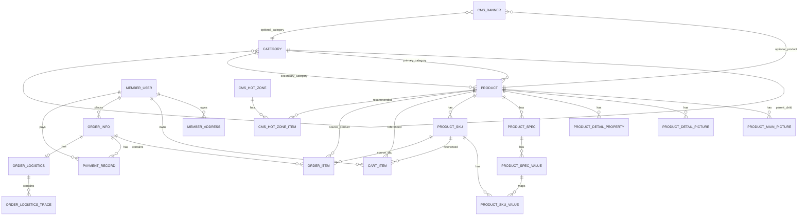

# 数据库 ER 设计

本设计基于 `docs/frontend-analysis/` 与 `docs/api-compare/final-endpoint-contract.md`，当前阶段只做数据库与初始化 SQL，不生成 Java 代码。

## 设计原则

- 以前端真实使用字段为准
- 表字段尽量贴近前端接口命名，如 `nickname`、`full_location`、`order_state`、`pay_channel`
- 所有表统一包含 `id`、`create_time`、`update_time`、`deleted`
- 订单、订单项、支付记录保留必要快照，避免商品价格和名称变化影响历史单据
- 首版优先覆盖：商品、分类、SKU、用户、地址、购物车、订单、订单项、支付记录
- 为支撑当前前端实际页面，补充首页内容表与物流表

## 核心实体关系

## 领域拆分

### 1. 分类与商品域

- `category`
  - 存储一级、二级分类
  - 用 `parent_id + level` 表达树结构
- `product`
  - 存储 SPU 级商品主信息
  - 与分类建立一级、二级归属关系
- `product_sku`
  - 存储 SKU 级库存、价格、图片、编码
- `product_spec` / `product_spec_value` / `product_sku_value`
  - 支撑前端商品详情规格选择
- `product_main_picture` / `product_detail_picture` / `product_detail_property`
  - 分别支撑主图轮播、详情图、商品属性

### 2. 会员域

- `member_user`
  - 支撑微信登录、H5 账号密码登录、个人资料维护
  - 存储 `account`、`mobile`、`avatar`、`nickname`、`profession` 等字段
- `member_address`
  - 与用户一对多
  - 结构直接对齐前端 `AddressItem`

### 3. 购物车域

- `cart_item`
  - 与用户一对多
  - 同时关联 `product` 与 `product_sku`
  - 保存前端直接依赖的 `selected`、`attrs_text`、`now_price`、`is_effective`
  - 同一用户同一 SKU 唯一

### 4. 订单域

- `order_info`
  - 订单头信息
  - 保存收货快照、金额汇总、配送方式、支付方式、状态流转时间
- `order_item`
  - 订单明细
  - 保存商品快照：`name`、`image`、`attrs_text`、`cur_price`、`quantity`
- `order_logistics` / `order_logistics_trace`
  - 支撑订单物流查询接口
  - `order_logistics` 存公司和运单号，`order_logistics_trace` 存轨迹节点

### 5. 支付域

- `payment_record`
  - 与订单一对多
  - 一次订单可有多次支付尝试
  - 保存渠道、方式、金额、第三方流水号、支付状态和原始报文

### 6. 首页内容域

- `cms_banner`
  - 支撑 `/home/banner`
  - 可按 `distribution_site` 区分首页和分类页轮播
- `cms_hot_zone` / `cms_hot_zone_item`
  - 支撑 `/home/hot/mutli` 和 `/hot/*`
  - `cms_hot_zone` 对应热门专区
  - `cms_hot_zone_item` 维护专区内商品和排序

## 主键与外键策略

- 所有表使用 `bigint unsigned` 自增主键 `id`
- 对外接口仍可将 `id` 序列化为字符串，兼容前端合同
- 首版保留外键，保证核心关系完整性
- 删除采用逻辑删除 `deleted`，不做物理删除

## 关键冗余策略

### 订单快照

以下字段必须冗余到 `order_item`，不能只靠关联商品实时查询：

- `name`
- `image`
- `attrs_text`
- `cur_price`
- `quantity`
- `real_pay`
- `total_money`

原因：

- 商品改名不影响历史订单
- SKU 价格变化不影响历史成交价
- SKU 属性变化不影响已下单商品展示

### 购物车冗余

以下字段建议冗余到 `cart_item`，减少列表查询时的实时拼装成本：

- `name`
- `picture`
- `price`
- `now_price`
- `attrs_text`
- `stock`
- `is_effective`

## 状态字段约定

### 分类与商品

- `category.is_show`: 是否展示
- `product.status`: 商品状态，建议 `1=上架, 2=下架`
- `product_sku.status`: SKU 状态，建议 `1=启用, 2=停用`

### 用户与地址

- `member_user.gender`: 直接存前端使用的文本值，如 `男/女/未知`
- `member_address.is_default`: `1/0`

### 购物车

- `cart_item.selected`: `1/0`
- `cart_item.is_effective`: `1/0`

### 订单

- `order_info.order_state`: 对齐前端枚举 `1待付款 2待发货 3待收货 4待评价 5已完成 6已取消`
- `order_info.pay_type`: `1在线支付 2货到付款`
- `order_info.pay_channel`: `1支付宝 2微信`
- `order_info.delivery_time_type`: `1不限 2工作日 3双休或假日`

### 支付

- `payment_record.pay_status`: 建议 `1待支付 2支付中 3支付成功 4支付失败 5已关闭`

## 首版不入库能力

以下能力已在分析文档中识别，但不纳入本次初始化表结构：

- 商品收藏
- 评价
- 售后
- 搜索历史/热词/联想
- refresh token / 登出黑名单

原因：这些能力当前不在前端强制闭环范围内。
